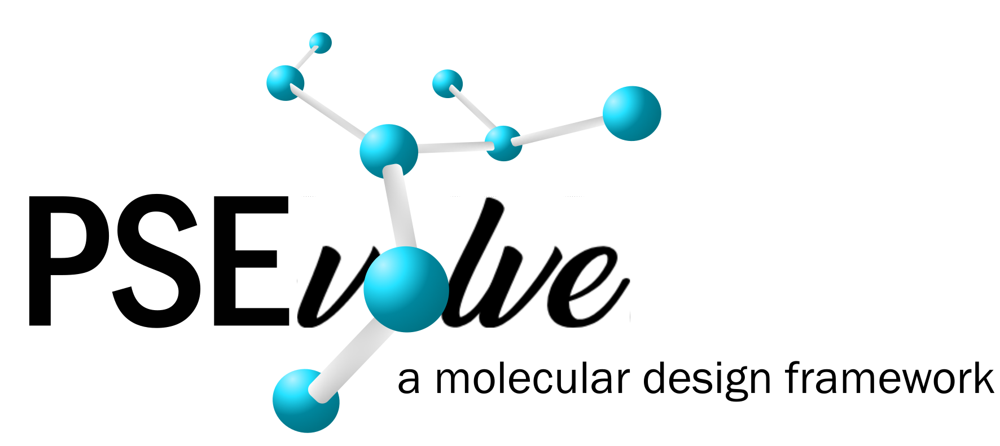

# PSEvolve - a graph-based molecular design algorithm


## Description
<p align="center">

</p>

PSEvolve is a graph-based genetic algorithm for molecular design. <br /> 
PSEvolve was applied for designing solvents with high lignin solubilities and lignocellulose processing [here](https://github.com/koenigmattern/PSEvolve_lignin_solvents).


main.py:
- main file for solvent design. 

utils.py:
- contains all functions of PSEvolve

How to cite PSEvolve:

```
@Article{
author ="Laura König-Mattern, Edgar I. Sancez Medina, Anastasia O. Komarova, Steffen Linke, Liisa Rihko-Struckmann, Jeremy Luterbacher, Kai Sundmacher",
title  ="Machine learning-supported solvent design for lignin-first biorefineries and lignin upgrading",
journal  ="Chemical Engineering Journal (submitted)",
year  ="2024"
}
```
## Requirements

The following packages are required:

- RDKit >= 2021.03.1
- networkx >= 2.6.3


## License 

This material is licensed under the [MIT License](LICENSE) and is free and provided as-is. <br />
If you use the code provided in this repository please cite the original publication.